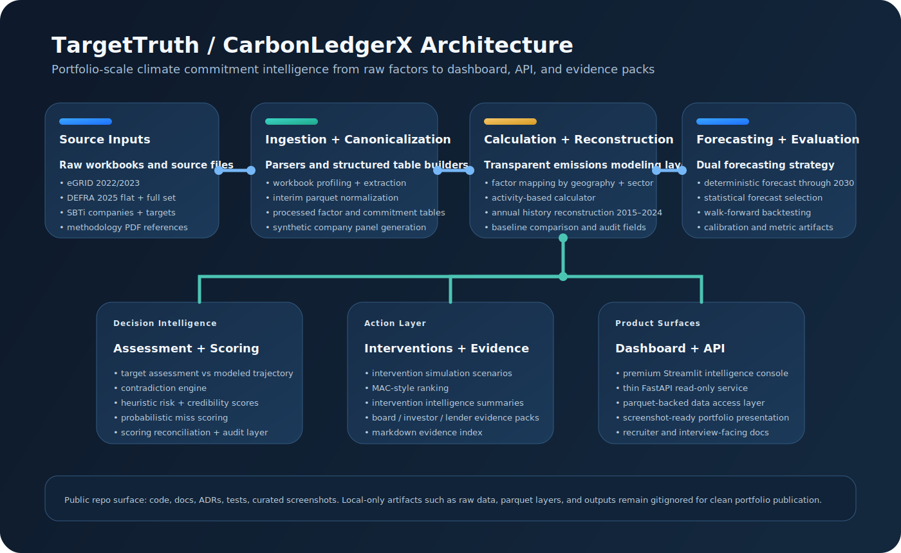
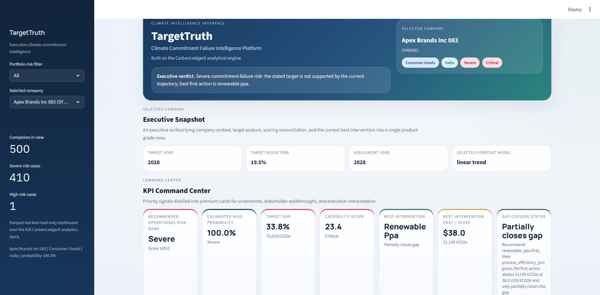
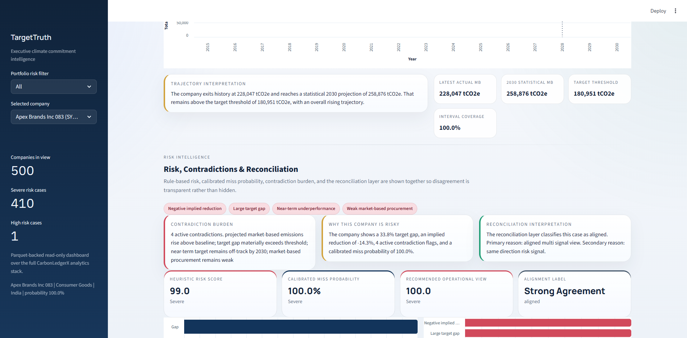
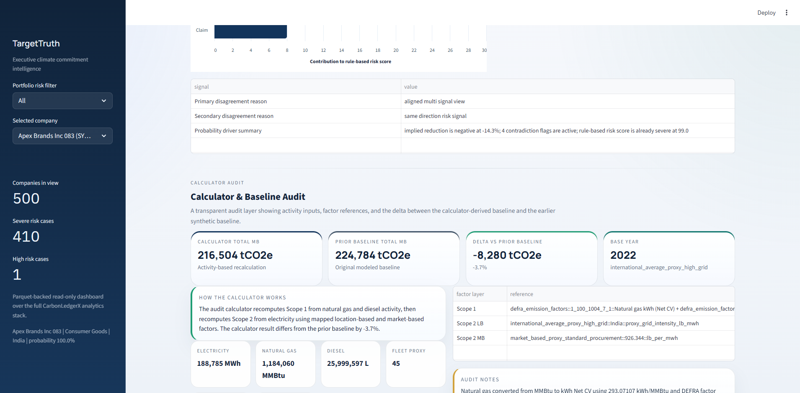
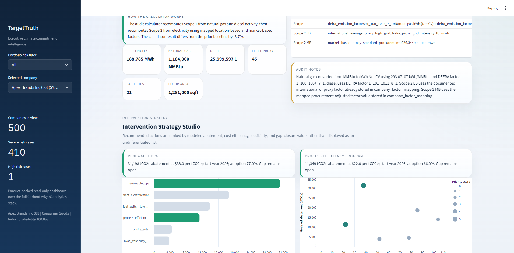

<p align="center">
  
</p>

<h1 align="center">TargetTruth</h1>
<p align="center"><strong>Climate Commitment Failure Intelligence Platform</strong></p>
<p align="center">Built on the CarbonLedgerX analytical engine</p>

<p align="center">
  <a href="https://github.com/yaswankum2622-code/cabonledgerX"></a>
  
  
  
  
  
</p>

<p align="center">
  
  
  
</p>

## What This Project Is

TargetTruth is a portfolio-scale climate intelligence product that asks a hard operational question:

> **Given a company's stated climate target, current operating footprint, modeled emissions path, and available interventions, how credible is the target and how likely is a miss?**

This repo is not a notebook bundle and it is not a generic ESG dashboard. It is a full analytical system with:

- factor ingestion for eGRID, DEFRA, and SBTi source workbooks
- canonical parquet layers for raw, interim, and processed data products
- a synthetic 500-company portfolio for repeatable modeling and demos
- an activity-based emissions calculator plus historical annual reconstruction
- deterministic forecasting and a separate statistical forecast stack with backtesting
- contradiction detection, heuristic scoring, probabilistic scoring, and score reconciliation
- intervention simulation, MAC-style ranking, and evidence-pack generation
- a premium Streamlit dashboard and a thin FastAPI service

## Why It Stands Out

- **Auditable**: the calculator layer shows activity inputs, factor references, and baseline deltas instead of hiding the math.
- **Methodologically honest**: deterministic and statistical forecasts are both exposed; the repo includes backtesting and calibration artifacts.
- **Decision-oriented**: the system does not stop at "risk high/low"; it ties risk to intervention ranking and evidence outputs.
- **Product-shaped**: the same analytical core is surfaced through docs, scripts, tests, dashboard, API, screenshots, and interview-ready architecture notes.

## Architecture

The platform is organized as a layered climate intelligence stack: raw factors and commitment data are normalized into processed tables, the calculator and reconstruction layers build a historical emissions view, forecasting layers project trajectories through 2030, scoring layers explain risk from multiple angles, and the final surfaces expose that intelligence through interventions, evidence, dashboard, and API.


## Product Gallery

<table>
  <tr>
    <td width="50%">
      
    </td>
    <td width="50%">
      
    </td>
  </tr>
  <tr>
    <td width="50%">
      
    </td>
    <td width="50%">
      
    </td>
  </tr>
</table>

## Core Capabilities

### 1. Factor and Commitment Data Pipeline
- profiles and inspects eGRID, DEFRA, and SBTi workbooks
- extracts machine-usable interim tables
- builds canonical processed factor and commitment layers

### 2. Activity-Based Emissions Logic
- generates sector-conditioned company activity inputs
- calculates Scope 1 and Scope 2 emissions from explicit factor references
- compares calculated outputs with the earlier synthetic baseline for auditability

### 3. Historical + Forecasting Stack
- reconstructs annual company emissions from 2015 through 2024
- keeps a deterministic forecast layer for transparent business-rule projection
- adds a statistical forecast layer with naive vs trend model backtesting and model selection

### 4. Risk Intelligence Stack
- commitment assessment vs forecasted trajectory
- contradiction flags
- rule-based risk and credibility scoring
- probabilistic commitment-miss scoring
- scoring reconciliation to handle disagreement cases explicitly

### 5. Decision Support
- intervention simulation and MAC-style ranking
- company-level intervention intelligence
- board, investor, and lender evidence packs
- FastAPI endpoints and a premium Streamlit intelligence console

## Repository Map

```text
src/carbonledgerx/
|- api/         # FastAPI service
|- config/      # project settings and paths
|- dashboard/   # premium Streamlit product surface
|- data/        # writers, catalogs, profiling helpers
|- models/      # calculator, forecasting, scoring, interventions
|- parsers/     # raw workbook inspection and extraction
+- utils/       # shared path and helper logic

scripts/         # phase-by-phase reproducible build entry points
tests/           # smoke tests for pipeline, dashboard, and API
docs/            # architecture, ADRs, deployment, interview prep
```

## Quickstart

```powershell
py -3.11 -m venv .venv
.venv\Scripts\Activate.ps1
python -m pip install --upgrade pip
python -m pip install -e .
python scripts/bootstrap_check.py
```

## Build Sequence

```powershell
python scripts/profile_raw_data.py
python scripts/extract_interim_tables.py
python scripts/build_processed_tables.py
python scripts/build_emissions_baseline.py
python scripts/build_forecast_and_assessment.py
python scripts/build_risk_and_contradictions.py
python scripts/build_intervention_scenarios.py
python scripts/build_evidence_packs.py
python scripts/build_activity_and_calculated_emissions.py
python scripts/build_historical_reconstruction.py
python scripts/build_statistical_forecast_and_evaluation.py
python scripts/build_probabilistic_scoring.py
python scripts/build_scoring_reconciliation.py
```

## How To Demo

Run the dashboard:

```powershell
python -m streamlit run src/carbonledgerx/dashboard/app.py
```

Run the API:

```powershell
python -m uvicorn src.carbonledgerx.api.main:app --reload
```

Open:

- Streamlit: `http://localhost:8501`
- FastAPI docs: `http://127.0.0.1:8000/docs`
- FastAPI redoc: `http://127.0.0.1:8000/redoc`

Best demo flow:

1. start on the executive overview and KPI command center
2. move to trajectory and model comparison to show rigor
3. open the calculator audit section to prove transparency
4. show risk reconciliation and intervention ranking
5. end with evidence-pack availability and API docs

## Documentation Map

- [01 Problem Statement](docs/01_problem_statement.md)
- [02 Architecture](docs/02_architecture.md)
- [03 Data Pipeline](docs/03_data_pipeline.md)
- [04 Calculator And History](docs/04_calculator_and_history.md)
- [05 Forecasting And Evaluation](docs/05_forecasting_and_evaluation.md)
- [06 Scoring And Reconciliation](docs/06_scoring_and_reconciliation.md)
- [07 Interventions And MAC](docs/07_interventions_and_mac.md)
- [08 Dashboard And API](docs/08_dashboard_and_api.md)
- [09 Innovations And Uniqueness](docs/09_innovations_and_uniqueness.md)
- [10 Future Work](docs/10_future_work.md)
- [Deployment](docs/DEPLOYMENT.md)
- [Interview Prep](docs/INTERVIEW_PREP.md)
- [Changelog](docs/CHANGELOG.md)
- [Architecture Decision Records](docs/adr)

## Why This Is Not A Generic ESG Dashboard

- It does not stop at static emissions cards; it reconstructs history and projects forward.
- It does not use a single opaque score; it exposes heuristic, probabilistic, and reconciled views.
- It does not bury assumptions; the calculator, forecast evaluation, and reconciliation layers are all explicit.
- It does not end at diagnosis; it recommends ranked interventions and evidence-pack outputs.

## Current Constraints

- company data is synthetic, so the repo demonstrates analytical method and product architecture rather than real issuer coverage
- some factor mapping logic uses documented proxies where direct company-specific factors do not exist
- probabilistic scoring is trained on synthetic deterministic labels, so it demonstrates calibrated methodology rather than production-grade empirical calibration
- the current storage model is local parquet-backed infrastructure rather than a database-backed deployment

## Best Docs To Read First

1. [02 Architecture](docs/02_architecture.md)
2. [04 Calculator And History](docs/04_calculator_and_history.md)
3. [05 Forecasting And Evaluation](docs/05_forecasting_and_evaluation.md)
4. [06 Scoring And Reconciliation](docs/06_scoring_and_reconciliation.md)
5. [08 Dashboard And API](docs/08_dashboard_and_api.md)
